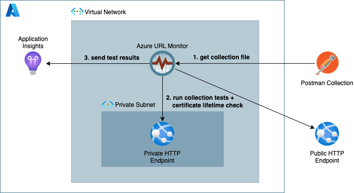

# Introduction

This project has been created as many of our Azure customers required monitoring of private http endpoints. As [Azure Application Insights](https://docs.microsoft.com/en-us/azure/azure-monitor/app/app-insights-overview) only offers to run availability tests against public endpoints and [Azure Connection Monitor](https://docs.microsoft.com/en-us/azure/network-watcher/connection-monitor-overview) didn't provide advanced enough http test configurations we decided to create an alternative solution. 

Because we :heart: working with [Postman](https://www.postman.com) we based the configuration of the availability tests on a Postman collection file. The Azure URL Monitor allows to run these tests from anywhere in your network and store the results in an [Azure Application Insights](https://docs.microsoft.com/en-us/azure/azure-monitor/app/app-insights-overview) instance.

Next to running Postman collection tests the Azure URL Monitor can run pro-active lifetime checks on SSL certificates. 



> **_NOTE:_**  This project is still work in progress but feedback is always welcome.


# Getting Started

To run the monitor successfully it needs at a minimum the `Instrumentation Key` of the Application Insights instance and an url to the `Postman collection` file.

The `Instrumentation Key` can be found in the overview` page of your Application Insights instance.

The `Postman collection URL` can be either to a [publicly shared Postman collection](https://learning.postman.com/docs/collaborating-in-postman/sharing/) using the JSON link option or to an [exported collection file](https://learning.postman.com/docs/getting-started/importing-and-exporting-data/#exporting-collections) on storage accessible via http.  

> **_NOTE:_**   If you don't have anything setup yet but want to to try out the monitor in your own Azure environment we have a [Bicep deployment](bicep/readme.md) available that deploys everything you need.

## Run Locally

The monitor relies on the [Newman](https://learning.postman.com/docs/running-collections/using-newman-cli/command-line-integration-with-newman/), the command-line Collection Runner for Postman.

Installing Newman using NPM
- Newman can be installed locally to this project together with an updated PATH export
```
 $ npm install newman
 $ export PATH=$PWD/node_modules/.bin:$PATH
```
- Now run the Python specific initialization

Using your running Python environment:

- Optionally refresh the requirements file: `pipenv requirements > requirements.txt`

- Install dependencies using: `pip install -r requirements.txt`

Using `pipenv` to local virtual Python environment:

- Initialize project specific Python env: `pipenv install`

- Drop into virtual Python env: `pipenv shell`

Start using the main script:

- Run: `./monitor.py --help`
- Or: `python monitor.py --help`

Example
```
$ ./monitor.py --ai-instrumentation-key  <your key> \
               --pm-collection-url <your collection url>

```

> **_NOTE:_**  The python code doesn't take care of scheduling. See [docker/entrypoint.sh](docker/entrypoint.sh) how this is handled inside a container.


## Run as a Container

### Build it Yourself 
Build the container:
```
$ docker build -t urlmonitor:latest --pull -f docker/Dockerfile .
```

Run the container:

```
$ docker run  -e AI_INSTRUMENTATION_KEY=<your key> \
              -e PM_COLLECTION_URL=<your collection url>\
              -e TEST_FREQUENCY_MINUTES=1 \
              urlmonitor
```

### Use a Pre-Built Container

```
$ docker run  -e AI_INSTRUMENTATION_KEY=<your key> \
              -e PM_COLLECTION_URL=<your collection url>\
              -e TEST_FREQUENCY_MINUTES=1 \
              ghcr.io/eurofiber-cloudinfra/azure-url-monitor:latest
              
```


## Run as an Azure Container Instance

Check the [Bicep code](bicep/readme.md) of the demo deployment.

# Configuration Options

| Container Environment Variable          | Description                                                                                                                                                             | Default Value | 
| --------------------------------------- | ----------------------------------------------------------------------------------------------------------------------------------------------------------------------- | ------------- |
| `AI_INSTRUMENTATION_KEY`                | Application Insights Instrumentation Key.                                                                                                                               | ''            |
| `PM_COLLECTION_URL`                     | Url to the json file containing the Postman Collection definition.                                                                                                      | ''            | 
| `TEST_FREQUENCY_MINUTES`                | Test frequency in minutes. If set to "0" will not repeat execution                                                                                                      | 5            | 
| `CERTIFICATE_VALIDATION_CHECK`          | Enable/disable certificate validation. When enabled the test will fail if the certificate is not valid.                                                                 | true          | 
| `CERTIFICATE_IGNORE_SELF_SIGNED`        | Enable/disable certificate failure when encountering self-signed certificates.                                                                                          | true          | 
| `CERTIFICATE_CHECK_EXPIRATION`          | Enable/disable certificate expiration check. When enabled the test will fail if certificate expires with the number of days specified in `CERTIFICATE_EXPIRATION_DAYS`. | true          | 
| `CERTIFICATE_EXPIRATION_GRACETIME_DAYS` | Number of days before the certificate will expire.                                                                                                                      | 14            | 
| `LOCATION`                              | User-defined test location or defaults to host IP. This location will appear in Application Insights                                                                    | <HOST_IP>     | 